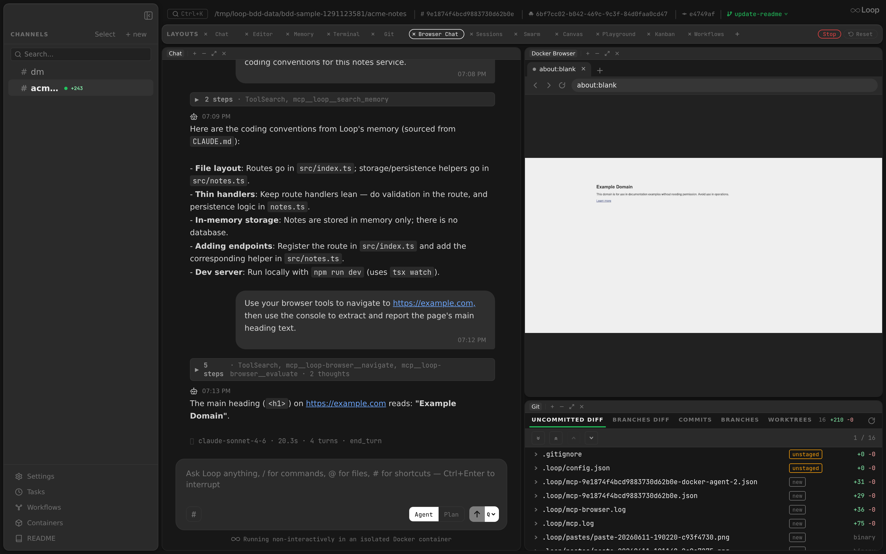

Manages Chrome browser instances for screencast streaming and MCP browser automation tools. Supports two modes: Docker (headless Chrome container per channel) and Host (user's local Chrome).



**Packages:** `internal/browser`, `internal/api` (handler), `internal/mcpbrowser` (MCP server)

## Architecture

```
Frontend (Electron)
  BrowserPanel ─── useBrowserWs
    │ WS: start/stop/screencast/input     │ HTTP: /api/browser/action
    ▼                                     ▼
┌──────────────────────────────────────────────────┐
│  browser_handler.go                              │
│  WS handler + action dispatcher                  │
│  Mode switching (Docker ↔ Host pill)             │
│  Idle monitoring                                 │
├──────────────────────────────────────────────────┤
│  BrowserProvider          CDPManager             │
│  (lifecycle only)         (CDP state)            │
│  ├─ DockerProvider        ├─ One browser WS conn │
│  │  Container CRUD        ├─ activeClient (tab)  │
│  │  Port mapping          ├─ Tab tracking        │
│  └─ HostProvider          ├─ Pane counting       │
│     DevToolsActivePort    └─ Notifications       │
├──────────────────────────────────────────────────┤
│  CDPClient / CDPSession                          │
│  Per-target chromedp context                     │
│  Navigate, screencast, input, tabs, JS, etc.     │
└──────────────────────────────────────────────────┘
                      │
                      ▼
                Chrome (CDP)
                Docker: headless container per channel
                Host: user's Chrome via DevToolsActivePort
```

## Two Modes

### Docker Mode (default)
- Headless Chrome in a dedicated container per channel (`loop-chrome-{channelID}`)
- Container created on first browser pane open, idle-stopped after timeout
- CDP endpoint: `ws://127.0.0.1:{hostPort}` (random mapped port)
- All tabs shown in UI (only agent-tracked tabs)
- Persistent per-channel profile (see [Agent profile](#agent-profile))

### Host Mode
- Connects to user's local Chrome via CDP
- Requires `chrome://inspect/#remote-debugging` enabled
- Discovery: reads `DevToolsActivePort` from Chrome's user data directory
- CDP endpoint: `ws://127.0.0.1:{port}/devtools/browser/{guid}`
- Only agent-created tabs shown (user's personal tabs hidden)
- Mode persisted per channel in localStorage

### Mode Switching
- Frontend pill toggle sends `POST /api/browser/mode`
- WS "start" message includes `mode` field (restores mode after daemon restart)
- Each mode has its own `CDPManager` (keyed `channelID|mode`)
- Switching preserves both tab sets

## Agent profile

In Docker mode the sidecar runs Chromium against `--user-data-dir=/profile`, backed
by a Docker **named** volume `loop-chrome-profile-{sanitized-channel-id}`. Named
volumes are not removed by `RemoveOptions{RemoveVolumes: true}`, so the profile
survives the idle stop and the container removal that follow it. Cookies, logins
and site data therefore persist across sidecar restarts and daemon restarts.

This gives the agent a durable identity that is *its own*, isolated from the
user's real Chrome profile — the thing Host mode cannot offer. The intended flow
is: the agent hits a login wall, calls `AskUserQuestion`, the channel parks, the
user signs in by driving the same tab through the browser pane, and answers. Every
later run reuses that session.

The volume is per channel, not shared with its threads: a channel and its threads
can run sidecars concurrently, and two Chromium processes on one `--user-data-dir`
collide on the profile singleton lock.

- Toggle with `browser.persist_profile` (default `true`). With it off, Chromium
  falls back to a throwaway in-container profile and nothing is mounted.
- **Reset profile** in the browser pane (`POST /api/browser/profile/reset`) stops
  the sidecar, removes the container and deletes the volume. It is docker-mode
  only — host mode returns `409`, since that profile belongs to the user.
- Deleting a channel removes its profile volume too; nothing else collects them.
- Chromium migrates a profile forward on upgrade but refuses to start on one
  written by a *newer* Chromium. That only comes up if `browser.chrome_image` is
  pinned back to an older tag — **Reset profile** is the recovery path.

## Extensions

Chromium in the sidecar runs `--headless=new`, which supports extensions — but
loop starts it with `--disable-extensions` unless `browser.extensions` is set.

The list holds **host directories, each containing an unpacked extension's
`manifest.json`**. Every entry is bind-mounted read-only into the sidecar and
handed to Chrome via `--load-extension`:

```json
"browser": {
  "extensions": ["/Users/me/chrome-extensions/ublock"]
}
```

Unpacked directories are the only route that works here. The Chrome Web Store's
"Add to Chrome" ends in a native confirmation bubble and `chrome://extensions`'
"Load unpacked" opens a native file picker; neither is part of the page, and the
screencast only streams the page — so neither can be driven from the browser
pane. A Web Store extension has to be unpacked to a directory on the host first.

Notes:

- Changing the list takes effect on the next sidecar start (**Reset profile**, or
  let it idle out), not on a running one.
- Order matters and is worth keeping stable: an unpacked extension's ID is
  derived from its path, and paths are assigned by position.
- `--disable-extensions` moved out of the image's entrypoint into the sidecar's
  args, because Chrome has no switch that undoes it — `--enable-extensions`
  alongside it still leaves extensions off. An install whose chrome image
  predates that change ignores the setting until the image is rebuilt, which
  happens automatically on the next loop version bump (see below) or immediately
  with `make docker-build`.

## Chrome image freshness

The sidecar image (`browser.chrome_image`, default `loop-chrome:latest`) is built
from `chrome.Dockerfile` at daemon start and stamped with `loop.version` /
`loop.built_at` labels. It is rebuilt when it is missing, unlabelled, or labelled
with a different loop version — so upgrading loop also pulls in the current
Chromium instead of freezing whatever Alpine shipped on the day of first install.

The rebuild uses `docker build --pull --no-cache`. Both flags are required:
`apk add --no-cache` only keeps apk's index out of the layer, and Alpine ships
Chromium patches into the branch repo without always republishing the base image,
so a cached or `--pull`-only build would silently re-tag the same old browser. The
image is a single `RUN`, so this costs a package re-download on version change
only, in the background. `make docker-build` is the manual escape hatch.

Dev builds (`dev`, `-g…`, `-dirty` versions) never trigger the version check —
the image is only built when it is missing.

## BrowserProvider

Thin interface for Chrome lifecycle — 6 methods, no CDP state.

```go
type BrowserProvider interface {
    EnsureBrowser(ctx, channelID, containerID) error
    StopBrowser(ctx, channelID) error
    IsRunning(ctx, channelID) bool
    GetCDPEndpoint(channelID) string
    GetContainerID(channelID) (string, bool)
    IsHostMode() bool
    RemoveProfile(ctx, channelID) error
}
```

### DockerProvider
- Creates/reuses Chrome containers with `docker create` + `docker start`
- Mounts the per-channel profile volume and passes `--user-data-dir`
- `RemoveProfile` deletes that volume
- Discovers mapped host port via `ContainerInspect`
- Reachability check via TCP dial (no `/json` HTTP API)

### HostProvider
- Discovers Chrome via `DevToolsActivePort` file
- Falls back to TCP dial on configured port
- `StopBrowser` clears session state only (does not kill Chrome)
- `RemoveProfile` is a no-op — the profile is the user's own

## CDPManager

Manages a single browser-level CDP connection and per-tab contexts. One CDPManager per `(channelID, mode)` pair.

### Connection Model

```
Connect() ──► cdpFactory (NewCDPClient)
                  │
                  ▼
              One WebSocket to Chrome browser endpoint
                  │
GetOrCreate() ──► NewContextForTarget(targetID)
                  │ (Target.attachToTarget over same WS)
                  ▼
              Fresh CDPSession per tab (no cache)
```

- `Connect()` creates the initial connection via factory (with retries for Docker)
- `GetOrCreate(targetID)` creates child contexts from the initial connection via `NewContextForTarget` — no new WebSocket dial, no Chrome permission prompt
- No client cache — each tab switch creates a fresh context (cheap: just `Target.attachToTarget`)

### Key Methods

| Method | Description |
|--------|-------------|
| `Connect(ctx)` | Initial CDP connection with retries |
| `GetOrCreate(targetID)` | Fresh context for target via existing WS |
| `ActiveClient()` | Current tab's CDPSession |
| `SwitchActive(targetID)` | Set active target ID |
| `TrackTab/UntrackTab` | Tab order management |
| `NotifyTargetSwitch/TabAdded/TabRemoved` | WS handler notifications |
| `PaneConnected/PaneDisconnected` | Pane count for idle monitoring |

## CDPClient (CDPSession interface)

Wraps a chromedp context attached to a single page target.

### Construction

```go
// Initial connection (used by CDPManager.Connect):
client, err := NewCDPClient(ctx, wsURL, logger, opts...)

// Child context for different target (used by CDPManager.GetOrCreate):
child, err := client.NewContextForTarget(targetID)
// Uses Target.attachToTarget over same browser WS — no new dial
```

### Operations

| Category | Methods |
|----------|---------|
| Navigation | `Navigate`, `Reload`, `GoBack`, `GoForward`, `GetPageInfo` |
| Screencast | `StartScreencast`, `StopScreencast`, `ResetScreencast` |
| Screenshots | `Screenshot` |
| Input | `MouseClick`, `MouseMove`, `MouseScroll`, `MouseDown`, `MouseUp`, `KeyPress`, `TypeText`, `InsertText` |
| Clipboard | `ReadSelection` |
| Accessibility | `GetElementRefs`, `ClickRef`, `ScrollIntoView` |
| Tabs | `ListTabs`, `NewTab`, `CloseTab`, `SwitchTarget` |
| JavaScript | `EvaluateJS` |
| Capture | `EnableConsoleCapture`, `EnableNetworkCapture` |
| Window | `ResizeWindow` |

## Clipboard

The sidecar has its own clipboard, inside the container, that the host cannot
read or write. Copy and paste in the browser pane therefore go over the
WebSocket rather than through the OS.

- **Paste** — the panel intercepts <kbd>Ctrl/Cmd</kbd>+<kbd>V</kbd>, reads the
  host clipboard with `navigator.clipboard.readText()` and sends
  `{"input_type": "paste", "text": ...}`. The handler calls `InsertText`, which
  maps to CDP `Input.insertText` — one shot, not a key event per character.
- **Copy** — <kbd>Ctrl/Cmd</kbd>+<kbd>C</kbd> sends `{"input_type": "copy"}`.
  The handler calls `ReadSelection` and replies with a `clipboard` message that
  the panel writes to the host clipboard. <kbd>Ctrl/Cmd</kbd>+<kbd>X</kbd> does
  the same and then dispatches the real key event so the page performs the cut.
- **Other shortcuts** — every other key event carries a `modifiers` bitmask
  (Alt=1, Ctrl=2, Meta=4, Shift=8). The sidecar runs Linux, so a macOS
  <kbd>Cmd</kbd> is sent as Ctrl.

`KeyPress` also sets `code` and the virtual key code, and — for keys that
produce input, currently only <kbd>Enter</kbd> — the `text` field. Chrome raises
`keydown` without `text`, but never generates the char event, so an Enter
missing it submits a form yet fails to insert a newline in a textarea. Text is
suppressed when a non-Shift modifier is held, so <kbd>Ctrl</kbd>+<kbd>Enter</kbd>
stays a shortcut instead of typing a newline.

## MCP Browser Tools

### Proxy Mode (agent containers)
Agent containers run `loop mcp-browser` which proxies all tool calls via `POST /api/browser/action` to the host. The handler routes through CDPManager.

### Direct Mode (standalone)
`loop mcp-host-browser` connects directly to Chrome via CDPClient (no CDPManager). Auto-discovers Chrome's DevTools endpoint via the `DevToolsActivePort` file. Can be used as a standalone MCP server for any Claude Code session:

```json
{
  "mcpServers": {
    "browser": {
      "command": "loop",
      "args": ["mcp-host-browser"]
    }
  }
}
```

Requires `chrome://inspect/#remote-debugging` enabled in Chrome.

### Available Tools
`navigate`, `read_page`, `computer`, `form_input`, `screenshot`, `save_screenshot`, `go_back`, `go_forward`, `reload`, `evaluate`, `list_tabs`, `new_tab`, `switch_tab`, `close_tab`, `page_info`, `get_page_text`, `find`, `read_console_messages`, `read_network_requests`, `resize_window`

## Idle Monitoring

`Server.RunBrowserIdleMonitor(ctx, timeout)` — single goroutine checks all CDPManagers. When a CDPManager has no connected panes and exceeds the timeout:
- CDPManager is closed (CDP connections cleaned up)
- For Docker mode: container is stopped and removed

## Last Tab Close

When the last tab is closed, a replacement `about:blank` tab is created **before** closing the old one (the active CDP client's context dies with the closed tab).

## Related Docs

- [Containers](containers.md) — Docker container lifecycle
- [Desktop App](desktop-app.md) — Electron architecture
