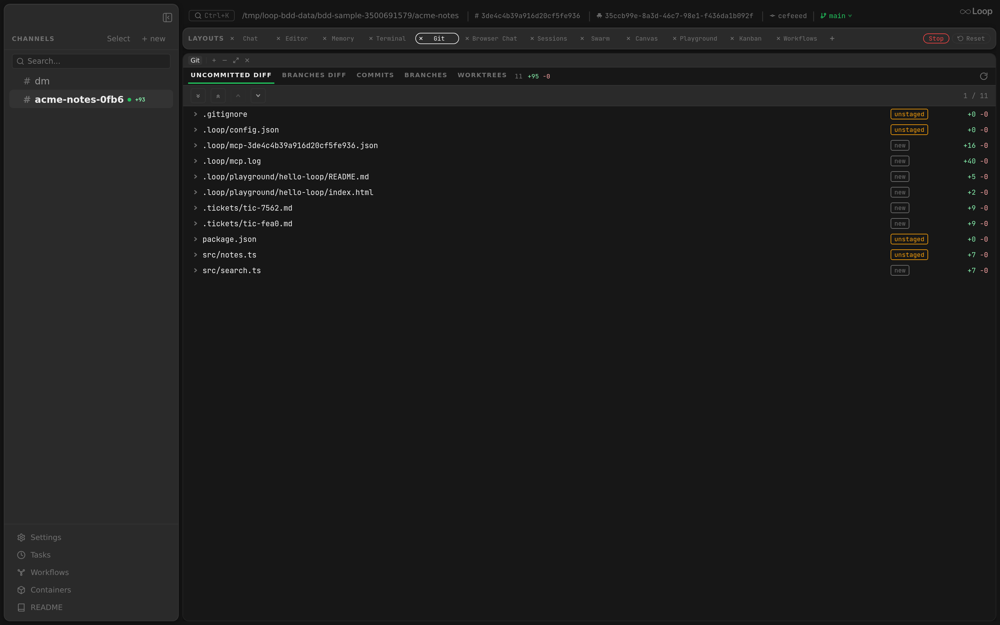

The Git panel surfaces a channel's repository state — uncommitted changes, branch comparisons, commit history, branches, and worktrees — without leaving Loop. It backs the agent's git work: as an agent edits and commits files in the sandbox, the panel refreshes live so you can see exactly what changed.

**Related docs:** [Layouts](layouts.md) | [Sidebar](sidebar.md) | [HTTP API — Git](api.md) | [Chat](chat.md)

---

## Overview

**Component:** `app/src/components/panels/GitPanel.tsx`

The panel has five tabs:

| Tab | Shows |
|-----|-------|
| **Uncommitted Diff** | The working-tree diff — staged and unstaged changes, file by file |
| **Branches Diff** | A diff between two selected branches ("Changes from" → "Land into") |
| **Commits** | The commit log for the selected branch |
| **Branches** | Local branches, with checkout |
| **Worktrees** | Git worktrees for the repo (see [Sidebar — Worktree threads](sidebar.md#thread-item)) |

## Live refresh

The panel keeps itself current without manual polling:

- A background poll refreshes every 5 seconds.
- A debounced WebSocket listener refreshes ~1 second after any channel event — so when an agent writes or commits a file, the diff and commit list update on their own.
- A manual **Refresh** button (circular-arrow icon) forces an immediate reload.

Because the workdir is bind-mounted into the agent container, commits the agent makes (with the repo-local git identity) appear in **Commits** as soon as they land.

## Multi-root repositories

For multi-root workspaces, a root selector lets you scope the diff to a specific directory; the diff endpoint accepts a `root` index so each root's changes are viewed independently.
