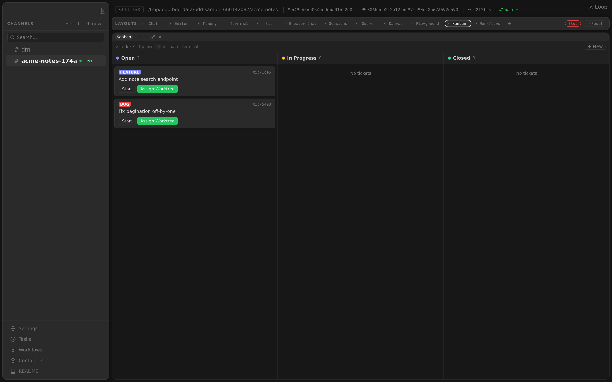

The Kanban panel provides a visual ticket board for managing work with the `tk` ticket system. Tickets are stored as markdown files in the project's `.tickets/` directory (via the [`github.com/radutopala/ticket`](https://github.com/radutopala/ticket) library) and shared between the CLI (`tk`), agents, and the Kanban UI.

**Related docs:** [HTTP API — Tickets](api.md#tickets) | [Events System](events.md) | [Layouts](layouts.md) | [Multi-Agent](multi-agent.md)

---

## Overview



The panel displays three status columns — **Open**, **In Progress**, and **Closed** — each showing ticket cards sorted by priority. Tickets flow left to right as work progresses.

```
┌──────────────┬──────────────────┬──────────────┐
│     Open     │   In Progress    │    Closed    │
├──────────────┼──────────────────┼──────────────┤
│  P0 bug      │  P1 feature      │  P2 task     │
│  P1 feature  │  P2 task         │              │
│  P3 task     │                  │              │
└──────────────┴──────────────────┴──────────────┘
```

The panel is a **singleton** (one per layout) and available in any channel, thread or worktree thread. It shows the tickets of the directory that channel works in — `<dir>/.tickets/`, exactly what `tk` lists from a shell in the same place. A thread inherits its channel's directory and so shares its board; a worktree thread has its own checkout, so it shows the tickets that checkout carries (none, when `.tickets/` is untracked). Live updates arrive via WebSocket events (`ticket.created`, `ticket.updated`, `ticket.deleted`, `channel.created`).

### Local / Root board in worktrees

Inside a worktree chain — a worktree thread, a thread under it, or a worktree cut from another worktree — the toolbar shows a **Local | Root** switch. **Local** (the default) is the worktree's own `<worktree>/.tickets/`; **Root** is the `.tickets/` of the checkout the chain was cut from, the board the project channel shows. Hovering either button shows the directory it reads. Everything on the board acts on the store it lists: creating, editing, moving, deleting and assigning a ticket from the Root board changes the root checkout's `.tickets/`. The choice sticks per channel in `localStorage` under `kanban-scope:{channelId}`, so it survives reloads and layout switches. Channels outside a worktree chain have one board and show no switch.

---

## Ticket Cards

Each card displays:

| Element | Description |
|---------|-------------|
| Priority badge | `P0`–`P4`, highlighted red for P0–P1 |
| Type tag | `bug`, `feature`, `task`, `epic`, `chore` — color-coded |
| Ticket ID | Short ID (e.g., `tic-a1b2`) |
| Title | Clickable — opens the edit drawer |
| Tags | Comma-separated list |
| Assignee | Shown when set |
| External ref | Shown when set. If the value starts with `http://` or `https://` it renders as an underlined link that opens in a new tab (`target="_blank"`); otherwise it's plain monospace text. The click is `stopPropagation`'d so it doesn't open the edit drawer. |
| Pull request | Same rendering as External ref — clickable link when the value is a URL, plain text otherwise. Set via the `pr` field on the ticket; surfaced in both the create and edit drawers' "More fields" section. |
| Dependency count | Shown when the ticket has dependencies |

### Status Actions

| Status | Available Actions |
|--------|------------------|
| Open | **Start** (move to In Progress), **Assign Worktree** (create worktree + agent) |
| In Progress | **Close**, **Reopen** |
| Closed | **Reopen** |

---

## Create Ticket

Click **"+ New"** in the panel header to open the create drawer.

### Required Fields

| Field | Description |
|-------|-------------|
| Title | Ticket title (required) |

### Optional Fields

| Field | Description |
|-------|-------------|
| Type | `task` (default), `bug`, `feature`, `epic`, `chore` |
| Priority | `P0`–`P4` (default: P2) |
| Description | Markdown description |
| Assignee | Free-text assignee name |
| Tags | Comma-separated tags |

### Advanced Fields (collapsible "More fields" section)

| Field | Description |
|-------|-------------|
| External Ref | Link to an external issue tracker (Jira, GitHub, etc.). Rendered as a clickable link on the card when the value is an `http(s)` URL. |
| Pull Request | URL of the PR backing this ticket. Rendered as a clickable link on the card when the value is an `http(s)` URL. |
| Parent | Parent ticket ID for sub-task relationships |
| Design | Design notes (markdown) |
| Acceptance | Acceptance criteria (markdown) |

### Drawer

The create and edit forms open in a drawer that slides in from the right edge of the panel and takes its full height. It covers at least 75% of the panel's width, and 760px (or the whole panel, if narrower) on smaller panels: `max(75%, min(760px, 100%))`. The header (title, ticket ID, **×**) and the action buttons stay put while the fields scroll between them. Every field has its name above it, so a filled-in field still says what it is. The description textarea is 8 rows; design and acceptance textareas are 5 rows. Clicking the dimmed board to the left, **×**, or `Esc` closes the drawer without saving; it slides back out before it unmounts. The create form's draft autosave keeps what was typed.

Draft form state auto-persists to `localStorage` per channel under the key `kanban-draft:{channelId}`, so in-progress ticket creation survives page reloads and panel switches. The draft is cleared on save and on explicit cancel-with-empty-form.

---

## Edit Ticket

Click a ticket's title to open the edit drawer. All fields from the create form are editable, plus:

| Field | Description |
|-------|-------------|
| Dependencies | Comma-separated ticket IDs that must close before this ticket becomes ready |

The edit drawer also includes an inline **Delete** button with "Delete? Yes / No" confirmation.

### Notes

Below the fields, the edit drawer lists the ticket's notes, oldest first, each with its timestamp in local time. These are the notes `tk add-note` writes. Type in **Add a note** and click **Add note** (or `⌘/Ctrl+Enter`) to append one. It is saved immediately, separately from **Save**, with the current time.

Notes are append-only, as in `tk`: the drawer can't edit or remove them, and saving the ticket's other fields leaves them untouched. A note added from chat or a terminal while the drawer is open appears as soon as the board refreshes.

---

## Assign Worktree

The **"Assign Worktree"** button on open tickets is the key integration between tickets and agents. It performs these steps atomically:

1. **Claim** — transitions the ticket from `open` to `in_progress` using an atomic file lock (`store.AtomicClaim`)
2. **Detect base branch** — resolves the current branch of the parent project
3. **Create worktree** — creates a git worktree on a new branch (`tk-<ticket-id>`) based on the current branch
4. **Create thread** — spawns a new thread named after the ticket title
5. **Set assignee** — writes the thread name as the ticket's assignee
6. **Start agent** — sends the ticket description as the initial message, auto-starting an agent in the worktree

After assignment, the ticket moves to the "In Progress" column and a new worktree thread appears in the sidebar.

The button works from anywhere the panel does. Assigning from inside a worktree — the worktree thread, or a scheduled task's thread under it — walks up to the root checkout first, so the new worktree is cut from the project and its branch, never nested in the caller's. The ticket itself is claimed in the store it was listed from.

---

## Filesystem Storage

Tickets are stored in `.tickets/` inside the project directory as individual markdown files. This means:

- **Git-trackable** — tickets can be committed, branched, and merged alongside code
- **Shared** — the `tk` CLI, agents, and the Kanban UI all read/write the same files
- **No database** — no server-side state beyond the filesystem

The ticket library (`github.com/radutopala/ticket/pkg/ticket`) handles file I/O, ID generation, status transitions, dependency validation, and atomic operations.

---

## Relationship to `tk` CLI

The Kanban panel and the `tk` CLI are two interfaces to the same ticket store:

| Operation | Kanban UI | `tk` CLI |
|-----------|-----------|----------|
| List tickets | Panel columns | `tk list` |
| Create | "+ New" button | `tk create "title"` |
| Start work | "Start" button | `tk start <id>` |
| Close | "Close" button | `tk close <id>` |
| Assign worktree | "Assign Worktree" button | Manual: `tk start` + git worktree + thread |
| View details | Click title | `tk show <id>` |
| Delete | Edit drawer → Delete | `tk delete <id>` |
| Add dependency | Edit drawer → Dependencies | `tk dep add <id> <dep-id>` |
| Add note | Edit drawer → Notes | `tk add-note <id> "text"` |

Changes from either side are reflected in real-time (Kanban via WebSocket events, CLI visible on next `tk` command).

---

## REST API

See [HTTP API — Tickets](api.md#tickets) for full endpoint documentation.

| Method | Path | Description |
|--------|------|-------------|
| `GET` | `/api/tickets` | List tickets with filters |
| `POST` | `/api/tickets` | Create a ticket |
| `GET` | `/api/tickets/{id}` | Get a ticket by ID |
| `PATCH` | `/api/tickets/{id}` | Update ticket fields |
| `DELETE` | `/api/tickets/{id}` | Delete a ticket |
| `POST` | `/api/tickets/{id}/notes` | Append a note |
| `POST` | `/api/tickets/{id}/assign` | Assign worktree and start agent |

---

## WebSocket Events

| Event | Trigger | Scope |
|-------|---------|-------|
| `ticket.created` | `POST /api/tickets` | Global |
| `ticket.updated` | `PATCH /api/tickets/{id}` or assign | Global |
| `ticket.deleted` | `DELETE /api/tickets/{id}` | Global |

The Kanban panel subscribes to these events and re-fetches the ticket list on each one.
