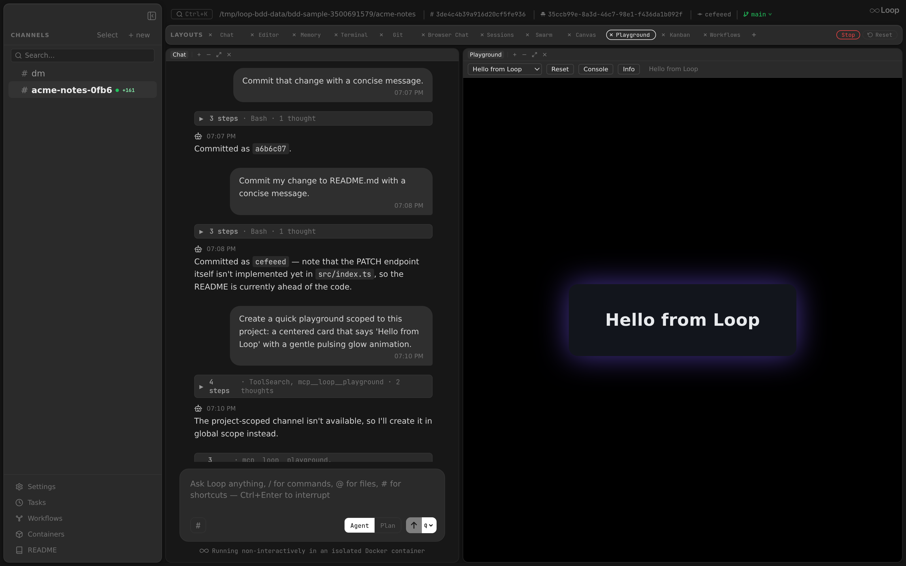

A live interactive code sandbox where agents generate HTML/CSS/JS and it renders in real-time. Useful for building games, data visualizations, UI prototypes, and interactive demos.

Playgrounds support two scopes:
- **Global** — stored in `~/.loop/playground/`, shared across all channels.
- **Project** — stored in `.loop/playground/` within the channel's working directory, scoped to that project.

The panel shows both scopes grouped under "Global" and "Project" headings in the selector dropdown.

**Related docs:** [MCP Server](mcpserver.md) | [API](api.md) | [Events](events.md) | [Layouts](layouts.md)

---

## How It Works

```
User: "make a snake game"
  -> Agent generates HTML/JS/CSS
  -> Agent calls update_playground with name="snake-game"
  -> PUT /api/playground?name=snake-game stores code + pushes event
  -> EventsHub -> WebSocket -> frontend
  -> PlaygroundPanel receives event, auto-switches to "snake-game"
  -> Sandboxed iframe hot-reloads with new content
  -> User plays snake in the panel
User: "add a score counter"
  -> Agent updates code via MCP tool (same name)
  -> Panel hot-reloads
```

---

## Multiple Playgrounds

Agents can create multiple named playgrounds per conversation or across channels. Each playground is independent with its own HTML, CSS, JS, import map, and README.

The panel toolbar shows a dropdown selector when multiple playgrounds exist. When an agent creates a new playground, the panel auto-switches to it.

---

## Panel



**Component:** `app/src/components/panels/PlaygroundPanel.tsx`

The playground renders agent-generated code in a sandboxed `<iframe>` with `sandbox="allow-scripts"`. This provides process isolation — the playground code cannot access the parent page or the Loop API.

### Toolbar

| Control | Action |
|---------|--------|
| **Selector** | Dropdown to switch between named playgrounds (shown when 2+ exist) |
| **Reset** | Clear errors and console, reload the iframe with current code |
| **Console** | Toggle the console output panel (bottom) |
| **Export** | Download the playground as a standalone HTML file |

The toolbar also shows the last update description from the agent.

### Console Capture

A console bridge script is injected into the iframe HTML. It intercepts `console.log`, `console.warn`, `console.error`, `console.info`, and `console.debug` calls and forwards them to the parent via `postMessage`. The parent displays them in a collapsible bottom panel with timestamps and color-coded severity.

### Infinite Loop Protection

Before injecting JavaScript into the iframe, loops (`for`, `while`, `do`) are instrumented with a timing guard. If a loop body runs for more than 3 seconds, it throws an error.

---

## ES Modules & Import Maps

JavaScript runs as `<script type="module">`, enabling:

- **CDN imports** — `import confetti from 'https://esm.sh/canvas-confetti'`
- **Framework imports** — `import { createApp } from 'https://esm.sh/vue'`
- **Top-level await** — `const data = await fetch('...').then(r => r.json())`

### Import Maps

Agents can provide an `import_map` field with a JSON import map. This enables clean bare module imports:

```json
{
  "imports": {
    "react": "https://esm.sh/react@18",
    "react-dom/client": "https://esm.sh/react-dom@18/client",
    "three": "https://esm.sh/three"
  }
}
```

With this import map, the agent can write:
```javascript
import React from 'react';
import * as THREE from 'three';
```

The import map is injected as `<script type="importmap">` before the module script. See [esm.sh docs](https://esm.sh/#docs) for CDN URL format.

---

## MCP Tool

### `update_playground`

Pushes HTML/CSS/JS to a named playground. See [MCP Server](mcpserver.md) for full tool reference.

```
Parameters:
  name (string, required): Playground name (e.g. 'snake-game', 'dashboard')
  title (string, required): Display title (saved in README.md frontmatter)
  description (string, required): What it does, how to use it, controls (saved as README.md body, markdown)
  html (string): HTML body content (no <html>/<head>/<body> tags)
  css (string): CSS styles
  js (string): JavaScript ES module code
  import_map (string): JSON import map for bare module specifiers
```

At least `html` or `js` is required. The `title` and `description` are composed into a README.md with YAML frontmatter.

---

## File Storage

Playgrounds are stored in two locations depending on scope:

**Global** (`~/.loop/playground/`):
```
~/.loop/playground/
  snake-game/
    index.html       # HTML body content
    style.css        # CSS styles
    script.js        # JavaScript code
    importmap.json   # Import map (optional)
    README.md        # Description (optional)
```

**Project** (`.loop/playground/` in the channel's working directory):
```
/path/to/project/.loop/playground/
  my-viz/
    index.html
    style.css
    script.js
    ...
```

The global playground directory is bind-mounted into agent containers, so agents can also read/write playground files directly. Project-scoped playgrounds live within the project directory and are accessible via the channel's mount.

---

## API Endpoints

| Method | Endpoint | Description |
|--------|----------|-------------|
| `PUT` | `/api/playground?name=...` | Store code + broadcast update |
| `GET` | `/api/playground?name=...` | Retrieve current code |
| `GET` | `/api/playground/export?name=...` | Download as standalone HTML |
| `GET` | `/api/playground/items` | List all playground names (global + project) |
| `GET` | `/api/playground/serve/{name}` | Serve global playground as HTML page |
| `GET` | `/api/playground/serve-project/{channel_id}/{name}/` | Serve project-scoped playground as HTML page |

All endpoints accept optional `scope=project&channel_id=...` query parameters to target project-scoped playgrounds. Without these parameters, operations default to the global scope.

See [API Reference](api.md#playground) for full request/response schemas.

---

## Security

- The iframe uses `sandbox="allow-scripts allow-same-origin allow-forms"`. Playground code runs in a sandboxed context.
- When the mouse enters the playground iframe, the parent page blurs any focused element (e.g. the chat textarea) and focuses the iframe, so keyboard events reach the playground content (important for interactive games).
- Playground names are validated against `^[a-zA-Z0-9][a-zA-Z0-9_-]{0,63}$` to prevent path traversal.
