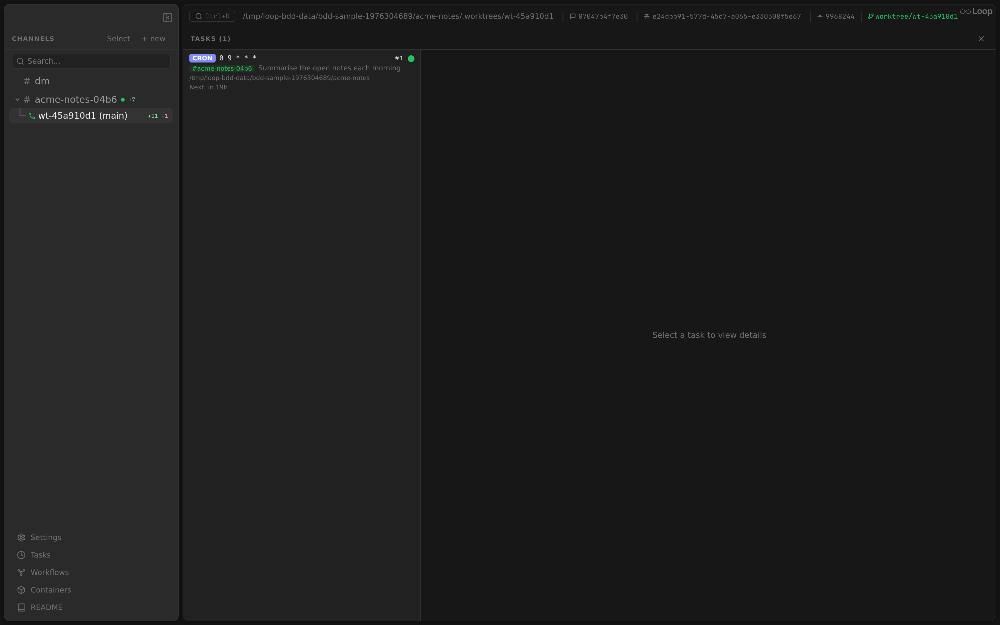
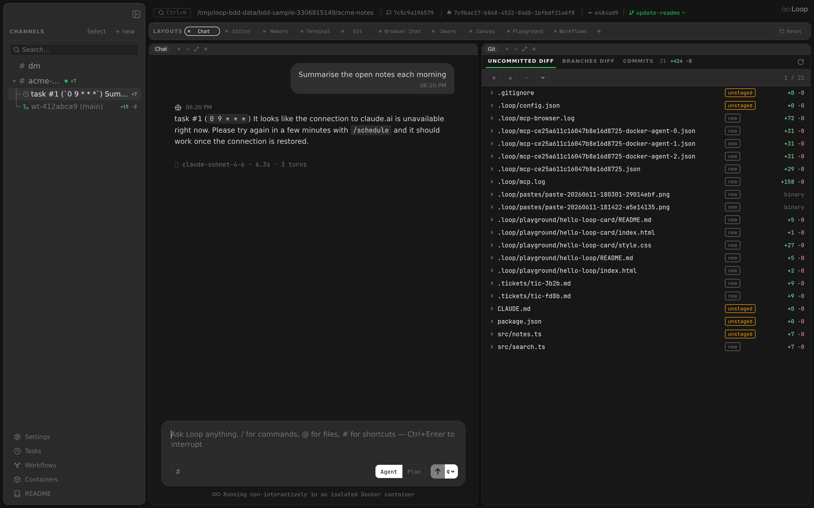

Loop includes a built-in task scheduler that executes agent prompts or workflow runs on a recurring or one-time basis. Tasks are stored in the database, polled on a timer, and executed inside Docker containers.

See also: [Configuration Reference](configuration.md) for `poll_interval_sec` and `task_templates` config fields. [Docker Container Lifecycle](containers.md) for how task containers are created.

---

## Task Types

Each task has a `type` that determines how its `schedule` field is interpreted.

### Cron (`"cron"`)

Standard 5-field cron expressions, parsed by [robfig/cron](https://github.com/robfig/cron).

| Field | Values |
|---|---|
| Minute | `0-59` |
| Hour | `0-23` |
| Day of month | `1-31` |
| Month | `1-12` or `JAN-DEC` |
| Day of week | `0-6` or `SUN-SAT` |

Examples:
```
* * * * *        # every minute
0 17 * * *       # daily at 5:00 PM
0 9 * * MON-FRI  # weekdays at 9:00 AM
*/15 * * * *     # every 15 minutes
0 0 1 * *        # first day of each month at midnight
```

After each execution, the next run time is computed using `sched.Next(now)`.

### Interval (`"interval"`)

Go duration strings. The next run is calculated as `now + duration` after each execution.

Examples:
```
5m       # every 5 minutes
30m      # every 30 minutes
1h       # every hour
2h30m    # every 2 hours 30 minutes
24h      # every 24 hours
```

### Once (`"once"`)

RFC3339 timestamps for single-execution tasks. The task is automatically disabled (`enabled = false`) after execution.

Examples:
```
2026-03-15T14:30:00Z          # UTC
2026-03-15T10:30:00-04:00     # with timezone offset
```

In the desktop UI, "once" tasks use a native date-time picker (stored as RFC3339 UTC) rather than a raw timestamp field.

### Manual (`"manual"`)

Manual tasks have **no schedule** and are never run by the poller. They exist as a saved prompt (or workflow) that you trigger on demand — "Run now" in the desktop Tasks panel, the `run_task` action, or `POST /api/tasks/{id}/run`. The `schedule` field is ignored (stored empty) and `next_run_at` is unused; listings show "on demand" instead of a next-run time.

Use a manual task for an on-demand routine you re-run periodically by hand (e.g. "summarise open notes") without committing to a fixed cadence.

---

## Task Lifecycle

### 1. Create

Tasks are created via:
- **Slash commands**: `/loop schedule` with `type`, `schedule`, and `prompt` options.
- **Templates**: `/loop template-add` loads a pre-defined template from config.
- **MCP tools**: `schedule_task` tool available to agents.

On creation:
- `calculateNextRun` computes the first `next_run_at` based on the task type and schedule.
- The task is stored in the database with `enabled = true`.

### 2. Poll

The scheduler runs a polling loop at a configurable interval (default 30 seconds, set via `poll_interval_sec`).

Each tick:
1. Queries the database for tasks where `next_run_at <= now AND enabled = true AND running = 0`.
2. Executes each due task sequentially.

Tasks that are already executing (`running = 1`) are excluded from the query, preventing the scheduler from re-triggering a long-running task.

#### Stale-running sweep on startup

`TaskScheduler.Start` runs `Store.ResetStaleRunningTasks(ctx)` before the first poll tick (`internal/scheduler/scheduler.go:73`). The defer that clears `running = 0` after a run fires inside `executeAndLog`, so a process killed mid-run (OOM, SIGKILL, panic, daemon restart) leaves rows flagged `running = 1` that would otherwise be permanently invisible to `GetDueTasks`. The sweep clears those flags, logs the count at warn level (`reset stale running tasks from prior daemon run`), and lets the next tick pick the rows back up.

The orchestrator does the same thing for chat messages — `Store.ResetStaleRunningMessages(ctx)` is called from `serve.go` during daemon startup and broadcasts the cleared `msg_id`s on `messages.processed` so the chat UI clears any "processing" pills that would otherwise remain stuck after an unclean shutdown.

### 3. Execute

For each due task:
1. The task is atomically claimed via `UPDATE ... SET running = 1 WHERE id = ? AND running = 0`. If `RowsAffected = 0`, another execution (e.g. a concurrent "Run Now") already claimed it and execution is skipped. This prevents concurrent runs even under race conditions.
2. A deferred release (`running = 0`) is registered so the flag is always cleared when execution finishes.
3. A `TaskRunLog` record is inserted with status `"running"`.
2. The task executor retrieves the channel from the database to get the session ID and work directory. Tasks with `workflow_name` delegate to the workflow engine ([Scheduled Workflows](#scheduled-workflows)); tasks with `bash_script` run the script directly ([Scheduled Bash Scripts](#scheduled-bash-scripts)); everything below applies to prompt tasks.
3. If the task has `worktree = true`, a git worktree is created (see [Worktree Isolation](#worktree-isolation) below).
4. An `AgentRequest` is built with:
   - The task's prompt as a user message. If `update_before_run` is enabled and `origin_branch` is set, git fetch/rebase instructions are prepended to the prompt.
   - A system prompt instructing the agent NOT to use `send_message`, `create_thread`, or `create_channel` MCP tools (responses are delivered automatically). The agent **may** use `queue_message` to enqueue a follow-up prompt for itself in the task's thread.
   - If `auto_delete_sec > 0`, the system prompt also instructs the agent to prefix "nothing to report" responses with `[EPHEMERAL]`.
   - For subsequent local-platform runs (thread already exists), the agent is registered under the thread's channel ID so the stop button in the thread view works.
5. The run's cancel function is registered in the orchestrator's `activeRuns` map, enabling the stop button and `/loop stop` command to cancel a running task.
6. The agent runs inside a Docker container (see [Containers](containers.md)).
7. The run log is updated to `"success"` or `"failed"` with the response or error text.

### 4. Update Next Run

After execution, the next run is determined by task type:

| Type | Behavior |
|---|---|
| `cron` | `next_run_at` set to the next matching time via the cron parser. |
| `interval` | `next_run_at` set to `now + duration`. |
| `once` | Task is disabled (`enabled = false`). No further runs. |

---

## Scheduled Workflows

Instead of an agent prompt, a task can trigger a workflow run by setting `workflow_name` on the scheduled task. When the scheduler fires such a task, it delegates to `workflow.Engine.StartRun` instead of launching an agent in a Docker container.

### Creating a Workflow Task

Use the same scheduling API/MCP tools as regular tasks, but provide `workflow_name` instead of (or in addition to) `prompt`:

```jsonc
// Via MCP tool
schedule_task({
  "schedule": "0 9 * * MON-FRI",
  "type": "cron",
  "workflow_name": "validate",
  "workflow_inputs": "{\"branch\": \"main\"}"
})
```

In the UI, the task create/edit form has a **Prompt | Workflow | Bash** mode toggle. Workflow mode is enabled when the channel has at least one workflow visible (merged global → parent → channel); the picker lists those workflows and renders inputs declared in the workflow definition, seeded with their defaults.

| Field | Description |
|---|---|
| `workflow_name` | Name matching a `workflows[]` entry in config. When set, the task runs the workflow instead of an agent prompt. |
| `workflow_inputs` | JSON object of inputs passed to `StartRun`. Must match the workflow's `inputs` definition. |

### Execution

When a workflow task fires:

1. The executor detects `workflow_name != ""` and branches early, skipping agent setup (worktree, session, streaming).
2. If `workflow_inputs` is set and not `"{}"`, it is parsed as `map[string]string`.
3. `workflow.Engine.StartRun` is called with the workflow name, channel ID, directory path, and inputs.
4. The returned run ID is recorded as the task run log's response text (e.g. `"workflow run started: wfr-abc123"`).
5. The workflow run executes asynchronously — the scheduler does not wait for workflow completion.

The task can be edited to change `workflow_name` or `workflow_inputs` via `edit_task` MCP tool or `PATCH /api/tasks/{id}`.

See also: [Workflows](workflows.md) for the full workflow engine documentation.

---

## Scheduled Bash Scripts

The third task flavor: setting `bash_script` on a task runs a shell script instead of an agent prompt or a workflow. The script executes inside the channel's **agent container** — same image, mounts, and syscall/proxy gates as agent runs, with the container timeout applied — via the same `RunBash` mechanism workflow script nodes use.

```jsonc
// Via MCP tool
schedule_task({
  "schedule": "0 8 * * *",
  "type": "cron",
  "bash_script": "df -h /work | tail -1"
})
```

- Works with every schedule type (`cron`, `interval`, `once`, `manual`).
- The script's output is posted to the channel as a bot message (fenced code block, truncated at ~3500 chars for chat); the task run log keeps the **full** output.
- On failure, the error is posted along with any partial output, and the run log records `failed`.
- `bash_script` is mutually exclusive with `prompt` and `workflow_name`; the create/edit API, the `schedule_task`/`edit_task` MCP tools, and the Tasks panels (per-channel and global, via the **Bash** mode with a monospace editor) all accept it.
- Bash tasks don't create threads or resume sessions — there is no agent involved.

---

## Thread Creation for Scheduled Tasks

Task execution streams output to a thread.

### Thread Reuse (Local Platform)

On the local platform (Electron app), recurring tasks (`cron`/`interval`) reuse the same thread across executions:

1. **First execution**: A new thread is created and its ID is stored in the task's `thread_id` column.
2. **Subsequent executions**: Messages are posted to the existing thread instead of creating a new one.
3. **Once tasks**: Always create a fresh thread (no reuse).

On Discord/Slack, a new thread is created for each execution (platform threads are ephemeral notification threads).

### Thread Naming

Thread names differ by platform:

| Platform | Format | Example |
|---|---|---|
| **Discord/Slack** | `⏱ task #<ID> (<schedule>) <prompt>` | `⏱ task #42 (*/5 * * * *) Check for new deployments...` |
| **Local** | `task #<ID> (<schedule>) <prompt>` | `task #42 (5m) Check for new deployments...` |

- The schedule is wrapped in backticks to prevent Slack/Discord markdown from mangling cron asterisks.
- The full string is truncated to 100 characters.
- The Electron sidebar shows a clock SVG icon for task threads (instead of the emoji).

### Thread Lifecycle

1. **First streaming turn**: A thread is created via `CreateSimpleThread` (no bot @mention to avoid re-triggering the agent).
2. **Subsequent turns**: Messages are sent to the thread.
3. **Final response**: Sent to the thread (or channel if thread creation failed). Duplicate detection prevents re-sending the last streamed turn.
4. **Thread channel record**: A DB channel record is upserted for the thread, inheriting the parent channel's guild, directory, platform, session, and permissions. For worktree tasks, the thread's `dir_path` is set to the worktree path and `worktree = true`.
5. **Permission users invited**: All RBAC owner and member users are invited to the thread.
6. **UI notification**: A `channel_created` event is broadcast so the Electron app sidebar refreshes.

If thread creation fails, the executor falls back to sending messages directly to the parent channel.

### Sub-Thread Resolution

When an agent running inside a task thread (sub-thread) schedules or lists tasks, the API automatically resolves the channel up to the parent thread. This ensures tasks are always associated with the correct parent rather than being nested deeper.

---

## Worktree Isolation

Tasks with `worktree = true` run the agent in an isolated git worktree so changes don't affect the main working directory.

### How It Works

1. **First run** (no `thread_id` yet):
   - The executor determines the base branch: if `origin_branch` is set on the task, that value is used; otherwise, the current branch is auto-detected via `git rev-parse --abbrev-ref HEAD` and persisted to `origin_branch` for future runs.
   - A new worktree is created at `{dir_path}/.worktrees/task-{id}-{hex}` on branch `worktree/task-{id}-{hex}`.
   - The worktree's `.loop/config.json` is seeded with `extra_dirs` pointing back to the parent project.
   - The parent channel's session file is copied so `--resume --fork-session` works.
   - The agent runs in the worktree directory instead of the channel directory.

2. **Subsequent runs** (recurring tasks with existing `thread_id`):
   - The executor looks up the thread's channel record and reuses its `dir_path`, which already points to the worktree from the first run.
   - If `update_before_run` is enabled and `origin_branch` is set, the executor prepends git update instructions to the user prompt: `git stash` → `git fetch origin {branch}` → `git rebase origin/{branch}` → `git stash pop`. This keeps the worktree up to date with the latest upstream changes.

3. **Thread record**: The thread channel created on first run has `worktree = true` and its `dir_path` set to the worktree path.

### Requirements

- The channel's `dir_path` must be a git repository. If `git rev-parse` fails (e.g., the directory is not a git repo), the task fails with a descriptive error.
- Detached HEAD is supported -- the executor falls back to the commit hash when `rev-parse --abbrev-ref HEAD` returns `"HEAD"`.

### Config Inheritance

Tasks running in a worktree directory use a three-layer config merge: **global → parent project → worktree**. This ensures settings like `claude_model`, `mounts`, and `mcp_servers` configured in the parent project's `.loop/config.json` are inherited automatically.

Because the worktree's seeded config sets `extra_dirs` to the parent project path, the parent project's own `extra_dirs` are **unioned** with the worktree's (rather than replaced), so the worktree mounts the same extra roots as the parent channel.

This applies in two cases:
- **`worktree = true` tasks**: The executor sets the parent channel's `dir_path` as the config parent.
- **Tasks scheduled from a worktree channel** (even with `worktree = false`): The executor resolves the worktree channel's parent and uses its `dir_path` for config inheritance.

Without this, a task on a worktree channel would only load `global → worktree`, and since worktree configs typically only contain `extra_dirs`, settings like `claude_model` from the parent project would be lost.

### UI Restrictions

The worktree checkbox in the Tasks panel is only shown when:
- The channel is **not** itself a worktree thread (worktree threads already run in isolation).
- The channel has a **git repository** (non-empty branch detected).
- In the **Global Tasks** panel, the worktree checkbox is hidden for tasks belonging to worktree channels.

---

## Tasks Panel



The Tasks panel (`tasks` panel type, singleton) provides a GUI for managing scheduled tasks within a channel. It can be added to any layout from the panel menu.

Selecting a task and pressing **▶ Run Now** triggers it immediately; the run opens as its own thread under the channel, which you can open from the sidebar to watch the agent work.



### Layout

The panel is split into two resizable panes:

- **Left pane** (200-500px): Task list with a `+` button to create tasks and a count header.
- **Right pane**: Task detail view showing the selected task's full details, action buttons, and run history.

### Create Form

Clicking `+` opens an inline form at the top of the task list with fields for:
- **Type** selector (Cron / Interval / Once)
- **Schedule** expression (placeholder adapts to the selected type)
- **Prompt** textarea
- **Worktree** checkbox (only shown for non-worktree channels with a git repo)
- **Origin branch** text field (shown when worktree is checked; leave blank for auto-detection)
- **Update before run** checkbox (shown when worktree is checked; prepends git rebase instructions)
- **Auto-delete** delay in seconds

### Task Detail View

Selecting a task shows:
- Task ID, type badge (color-coded), worktree badge if enabled, and origin branch
- Schedule expression and full prompt text
- Update-before-run indicator when enabled
- Next run time (relative) when enabled
- Auto-delete delay when configured
- **Enable/Disable** button to toggle the task
- **Edit** button to open an inline edit form
- **Delete** button to permanently remove the task

### Run History

Below the task details, a scrollable list shows all `TaskRunLog` entries with:
- Status indicator (green = success, red = failed, yellow = running)
- Relative timestamp
- Error text (on failure)
- Response text preview (truncated to 200 chars)

### Real-Time Updates

The panel subscribes to the event stream and refreshes the task list on any `task.*` event. Run history refreshes on `task.run_completed` events.

---

## Auto-Deletion

Tasks with `auto_delete_sec > 0` support ephemeral execution:

### Ephemeral Marker

The agent is instructed to prefix responses with `[EPHEMERAL]` when there is nothing meaningful to report. The marker is:
- Stripped from the response text before delivery.
- Stripped from streaming turns before the stream tracker records them.

### Deletion Flow

When `auto_delete_sec > 0` and a thread was created:

1. If the response contains `[EPHEMERAL]`:
   - **Discord/Slack**: The thread is renamed, replacing `⏱` with `💨` (puff emoji) to visually indicate ephemeral status.
   - **Local**: The thread name is prefixed with `[ephemeral]`. The Electron sidebar shows an undo-arrow SVG icon.
2. A `time.AfterFunc` is scheduled with the configured delay.
3. After the delay, the thread is deleted via `bot.DeleteThread` and a `channel_deleted` event is broadcast to the UI.

This allows heartbeat-style tasks to create threads that auto-clean when there is nothing to report.

---

## Task Templates

Templates are pre-defined task configurations in the global config. They allow quick deployment of common tasks without typing full schedules and prompts.

### Template Fields

| Field | Description |
|---|---|
| `name` | Unique identifier. Used by `/loop template-add` and for deduplication. |
| `description` | Shown in `/loop template-list` output. |
| `schedule` | Cron expression, Go duration, or RFC3339 timestamp. |
| `type` | `"cron"`, `"interval"`, `"once"`, or `"manual"`. |
| `prompt` | Inline prompt text. |
| `prompt_path` | File path resolved as `~/.loop/templates/{prompt_path}`. |
| `worktree` | Run the agent in an isolated git worktree (default: `false`). |
| `origin_branch` | Base branch for worktree tasks. Auto-detected from parent repo on first run if not set. |
| `update_before_run` | When `true`, prepends git fetch/rebase instructions to the prompt before each run. |
| `auto_delete_sec` | Auto-delete delay for the task's thread. |

### Prompt Resolution

Exactly one of `prompt` or `prompt_path` must be set:

- **`prompt`**: The text is used directly as the task prompt.
- **`prompt_path`**: The file at `~/.loop/templates/{prompt_path}` is read and its contents used as the prompt. This allows long, detailed prompts to be maintained as separate files.

Setting both or neither is an error.

### Template Loading

When `/loop template-add` is invoked:
1. The template is looked up by name in the config's `task_templates` array.
2. A check ensures no task with the same `template_name` already exists in the channel (prevents duplicates).
3. The prompt is resolved via `ResolvePrompt`.
4. A new `ScheduledTask` is created with the template's settings and `template_name` set for tracking.

### Template Merging (Project Config)

Project configs can define their own `task_templates`. Templates are merged by name:
- If a project template has the same `name` as a global template, the project version replaces it.
- New template names are appended to the list.

---

## Task Management Commands

All commands are available as slash commands (`/loop <command>`) and MCP tools.

### Create

```
/loop schedule type:<cron|interval|once|manual> schedule:<expression> prompt:<text> [worktree:<true|false>] [origin_branch:<branch>] [update_before_run:<true|false>]
```

Creates a new task. The scheduler calculates `next_run_at` and enables the task immediately. Set `worktree: true` to run the task in an isolated git worktree (see [Worktree Isolation](#worktree-isolation)). Optionally set `origin_branch` to pin the base branch (otherwise auto-detected on first run) and `update_before_run: true` to prepend git rebase instructions before each execution.

### List

```
/loop tasks
```

Lists all tasks for the current channel with their ID, type, status (enabled/disabled), schedule, prompt (truncated to 80 chars), next run time (as relative duration), and auto-delete setting if configured.

### Show

```
/loop task task_id:<id>
```

Shows full details of a single task: type, schedule, status, next run, template name (if from a template), auto-delete setting, and the complete prompt text.

### Cancel

```
/loop cancel task_id:<id>
```

Permanently deletes a task from the database.

### Toggle

```
/loop toggle task_id:<id>
```

Flips a task's enabled state. Disabled tasks are skipped during poll cycles but remain in the database.

### Edit

```
/loop edit task_id:<id> [schedule:<expr>] [type:<type>] [prompt:<text>] [worktree:<true|false>] [origin_branch:<branch>] [update_before_run:<true|false>]
```

Updates one or more fields of an existing task. If `schedule` or `type` changes, `next_run_at` is recalculated. At least one field must be provided.

### Load Template

```
/loop template-add name:<template_name>
```

Creates a task from a configured template. Prevents duplicate loading of the same template in a channel.

### List Templates

```
/loop template-list
```

Shows all configured templates with their name, type, schedule, and description.

---

## Poll Interval

The scheduler polls the database on a fixed interval, configured via `poll_interval_sec` (default: 30 seconds). This means:

- Tasks may execute up to `poll_interval_sec` seconds after their scheduled time.
- Very short intervals (e.g. `5s`) increase database load.
- The poll loop uses `time.NewTicker` and stops cleanly on context cancellation.

---

## Run Logging

Every task execution is recorded in a `TaskRunLog`:

| Field | Description |
|---|---|
| `task_id` | The task that was executed. |
| `status` | `"running"`, `"success"`, or `"failed"`. |
| `response_text` | Agent response on success. |
| `error_text` | Error message on failure. |
| `started_at` | When execution began. |
| `finished_at` | When execution completed. |

The log is created with `"running"` status before execution starts and updated to the final status after the agent returns.
