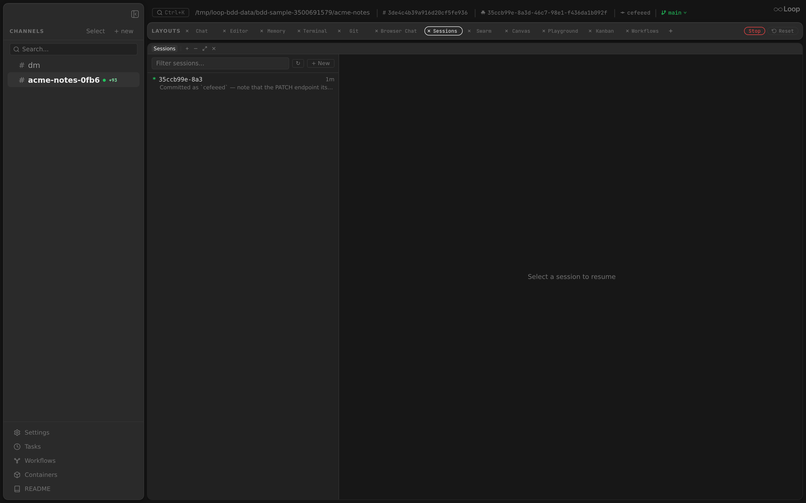

The Sessions panel lists the past Claude Code sessions for a channel and lets you resume any of them. Each agent run in a channel produces a session transcript on disk; the panel reads those and shows them newest-first with a one-line summary.

**Related docs:** [Agent](agent.md) | [Orchestrator](orchestrator.md) | [Layouts](layouts.md)

---

## Overview

**Component:** `app/src/components/panels/SessionsPanel.tsx`

Sessions are read from `GET /api/channels/{id}/sessions`, which scans the Claude session store under `$HOME/.claude/projects/<encoded-workdir>/*.jsonl` (the workdir path is encoded the way Claude Code stores it). Each entry shows its session id and a short summary derived from the transcript, along with how long ago it ran.

## Resuming

Selecting a session resumes that conversation — the next message continues from where it left off (`claude --resume <session-id>`), so context, file state, and history carry over. A filter box narrows the list, and **+ New** starts a fresh session instead of resuming.

The empty state ("No sessions found") simply means no agent has run in the channel yet.
