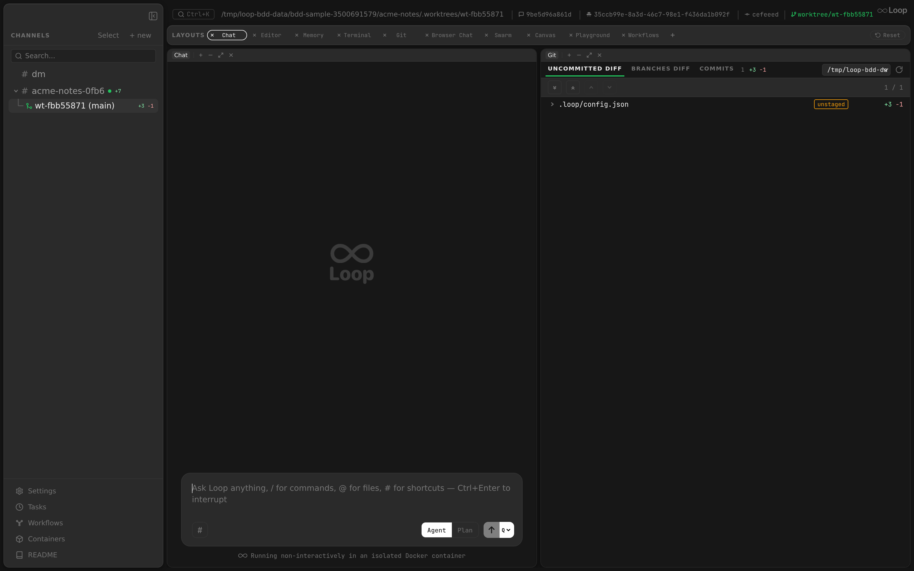

The sidebar provides the primary navigation structure for the Loop desktop app. It lists channels and threads, supports drag-and-drop reordering, batch selection, search filtering, and houses the app's footer actions.

Related docs: [Desktop App](desktop-app.md) | [Layouts](layouts.md) | [Settings](settings.md) | [Chat](chat.md)

---

## Layout

The sidebar is a vertical column on the left side of the app with the following sections, top to bottom:

1. **Drag region** (38px) -- macOS window dragging area with a collapse button at the top-right
2. **Header bar** -- "CHANNELS" label with Select and "+ new" buttons
3. **Search box** -- filter channels and threads
4. **New channel input** -- inline text field (shown when creating)
5. **DM channel** -- pinned at top
6. **Project channels** -- sortable list with collapsible threads
7. **Spacer** -- pushes footer to bottom
8. **Footer** -- update button, settings, README
9. **Resize handle** -- right edge for width adjustment

---

## Dimensions

| Property | Value |
|----------|-------|
| Minimum width | 180px |
| Maximum width | 25% of window width |
| Default width | 280px |

The width is adjusted via a 4px-wide resize handle on the right edge:
- Cursor changes to `col-resize` on hover
- Handle becomes visible (`colors.textDim`) on hover and during drag
- A 1px border-right (`colors.border`) is always visible
- `user-select: none` is applied during drag to prevent text selection

When collapsed (`sidebarOpen === false`), the entire sidebar is hidden (returns `null`). An expand button appears in the workspace layout's top drag region to restore the sidebar.

---

## Channel Ordering

### Drag-and-Drop

Top-level channels (not threads, not DM) support drag-and-drop reordering:

1. Each `ChannelItem` has `draggable` set on its container.
2. On drag start, the channel ID is stored in `draggedIdRef`.
3. On drag over, the target channel shows a green top border (`2px solid colors.active`).
4. On drop, the channel order array is updated: the source is removed from its position and inserted at the target position.

### Persistence

Channel order is stored in `localStorage` under the key `loop-channel-order` as a JSON array of channel IDs. Channels not in the stored order sort to the end.

---

## Search

The search box sits below the header and provides real-time case-insensitive filtering.

### Behavior

- Filters top-level channels by name match
- Shows a parent channel if any of its threads match (even if the parent name does not match)
- When the parent matches, all its threads are shown
- When only threads match, only those matching threads are shown under the parent
- Press `Escape` to clear the search query

### UI

- Search icon (magnifying glass) positioned inside the input field (left-aligned)
- Input: full width, `colors.bg` background, 12px font, 4px border-radius
- Placeholder: "Search..."

---

## Selection Mode

Clicking "Select" enters batch selection mode.

### Behavior in Select Mode

- Each channel and thread shows a checkbox instead of the collapse chevron
- The DM channel is excluded from selection (pinned, not selectable)
- Checked items have a green border and background with a checkmark icon
- Header shows:
  - **"Delete (N)"** button -- deletes all selected items (red on hover)
  - **"Cancel"** button -- exits selection mode and clears selections

### Batch Delete

Channels and threads are deleted individually in sequence. If the currently selected channel is among the deleted, the selection is cleared.

---

## Create Channel

Clicking "+ new" opens a dropdown menu with two options:

| Option | Action |
|--------|--------|
| **New project** | Shows an inline text input in the sidebar. Enter submits, Escape/blur cancels. |
| **Open directory...** | Opens a native directory picker dialog (via `showOpenDirectoryDialog` IPC), then runs `onboard:local` and creates/selects the channel. Only available in Electron. |

The dropdown is a positioned overlay that closes on outside click (left mousedown).

---

## DM Channel

The DM channel is always pinned at the top of the channel list:
- Identified by `name === "dm"` and no `parent_id`
- Created automatically on first load if it does not exist (`ensureChannel`)
- Auto-selected on first load if no channel is selected and no hash is present
- Cannot be deleted (excluded from context menu delete option)
- Cannot be selected in batch selection mode

---

## Channel Item

Each channel item (`ChannelItem` component) displays:

### Visual Elements

| Element | Description |
|---------|-------------|
| Collapse chevron | Shown when channel has threads. Rotates 90 degrees when collapsed. Click to toggle. |
| Hash symbol (`#`) | Channel prefix, dimmed text |
| Channel name | Truncated with ellipsis. Shows `dir_path.split("/").pop()` if no name set. |
| Status pills | `rev` (`colors.active`) when a review session is open, `ask` (`colors.warning`) when an agent is parked on an `AskUserQuestion` card. Pills come from store refs (`reviewChannelIdsRef`, `askUserChannelIdsRef`) that are kept in sync via WebSocket events and rehydrated on reconnect against `/api/review/sessions` and `/api/asks/pending`. |
| Status indicator | Green dot (6px circle, `colors.active`) when `container_running` or `agent_running` is true |
| Config button (gear icon) | Shown on hover for channels with `dir_path`. Opens project settings. |
| "+ thread" button | Shown on hover. Toggles the new thread input. |

### Interaction

| Action | Behavior |
|--------|----------|
| Click channel name | Select the channel |
| Click collapse chevron | Toggle thread visibility |
| Double-click channel row | Collapse/expand threads |
| Hover | Shows config and thread buttons; applies `colors.hoverBg` background |
| Right-click | Opens context menu |
| Drag | Initiates channel reorder |

### Context Menu

Right-clicking a channel opens a context menu with:

| Item | Action |
|------|--------|
| **Copy Link** | Copies `loop://channel/<id>` to clipboard |
| **Copy Channel ID** | Copies the raw channel ID |
| **Delete Channel** | Deletes the channel (not shown for DM) |

The "Delete Channel" item has `danger: true` styling (red text) and a separator above it.

---

## Thread Item

Threads are listed below their parent channel, indented with a tree connector line. Threads can contain sub-threads (e.g. scheduled task threads), forming a 3-level hierarchy.

### Visual Elements

| Element | Description |
|---------|-------------|
| Tree connector | SVG with vertical line and horizontal branch at 50% height. Last thread's vertical line stops at 50%. Positioned at 16px left offset. Z-index 1 to stay above hover backgrounds. |
| Worktree icon | Git branch SVG icon (`colors.active`) for worktree threads. |
| Task thread icon | Clock SVG icon (`colors.textDim`) for scheduled task threads (detected by `task #` name prefix). |
| Ephemeral icon | Undo-arrow SVG icon (60% opacity) for ephemeral task threads (detected by `[ephemeral]` prefix). |
| Thread name | Truncated with ellipsis. Task thread names have emoji prefixes (`🧵`, `⏱`) stripped for display. Falls back to thread ID. |
| Status pills | Same set as channels: `rev` for an open review session and `ask` when an agent is parked on an `AskUserQuestion` card. |
| Status indicator | Green dot when `container_running` or `agent_running`, positioned at the right edge. |
| Checkbox | Shown in selection mode instead of normal layout |
| Sub-threads | Rendered recursively below the thread with the same connector style. |

### Indentation

Threads are indented with `padding-left: 30px` (accounting for the tree connector). The connector line uses `colors.textDisabled` (`#555555`) at 1.5px stroke width.

### Interaction

| Action | Behavior |
|--------|----------|
| Click | Select the thread |
| Hover | `colors.hoverBg` background |
| Right-click | Opens the same context menu as channels |

### Create Thread

Clicking "+ thread" on a channel reveals an inline input (`NewThreadInput`) below the channel. Behavior:
- `Enter` submits the thread name
- `Escape` or blur cancels
- The input auto-focuses on mount

### Delete Thread

Threads can be deleted via:
- Context menu "Delete Channel" (same operation for threads)
- Batch selection mode

---

## Footer

The footer sits at the bottom of the sidebar, separated by a top border.

### Update Button

Only shown when `updateStatus?.available` is true. The button text and behavior depend on the update state:

| State | Text | Color | Action |
|-------|------|-------|--------|
| Available | "Update available vX.Y.Z" | `colors.active` (green) | Download update |
| Downloading | "Downloading..." | `colors.textDim` | Disabled (no action) |
| Downloaded | "Restart to update" | `colors.active` (green) | Install and restart |
| Error | "Update failed -- click to retry" | `colors.active` | Retry download |

The button includes a download icon (arrow into tray).

### Kanban Button

- Board icon + "Kanban" text
- Click opens the [Kanban panel](kanban.md) as an overlay
- `colors.textDim` text, brightens on hover

### Settings Button

- Gear icon + "Settings" text
- Click opens the [Settings panel](settings.md)
- Keyboard shortcut: `Cmd+,` (handled at the app level)
- `colors.textDim` text, brightens on hover

### README Button

- Book icon + "README" text
- Click opens the README markdown panel
- `colors.textDim` text, brightens on hover

---

## Window Title

The app title bar updates based on the selected channel/thread (handled in `App.tsx`):

| Selection | Title |
|-----------|-------|
| None | `Loop` |
| Channel | `<channel-name> - Loop` |
| Thread | `<parent-name> > <thread-name> - Loop` |
