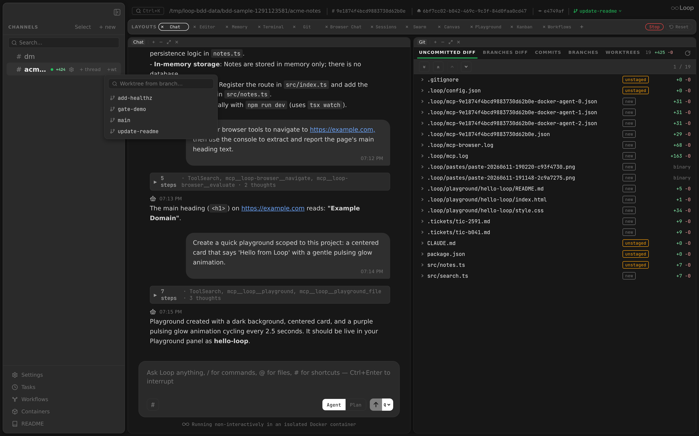

The sidebar provides the primary navigation structure for the Loop desktop app. It lists channels and threads, supports drag-and-drop reordering, batch selection, search filtering, and houses the app's footer actions.

Related docs: [Desktop App](desktop-app.md) | [Layouts](layouts.md) | [Settings](settings.md) | [Chat](chat.md)

---

## Layout

The sidebar is a vertical column on the left side of the app with the following sections, top to bottom:

1. **Drag region** (38px) -- macOS window dragging area with a collapse button at the top-right
2. **Header bar** -- "CHANNELS" label with Select and "+ new" buttons
3. **Search box** -- filter channels and threads
4. **New channel input** -- inline text field (shown when creating)
5. **Tabs** -- Recent and Tree, with the open tab's task-thread toggle at the right; only the toggle when nothing is recent
6. **Recent** tab -- sessions from anywhere in the tree, active ones first (see [Recent Sessions](#recent-sessions))
7. **Tree** tab -- the DM channel, pinned at top, then the project channels as a sortable list with collapsible threads
8. **Spacer** -- pushes footer to bottom
9. **Footer** -- update button, settings, README
10. **Resize handle** -- right edge for width adjustment

---

## Dimensions

| Property | Value |
|----------|-------|
| Minimum width | 180px |
| Maximum width | 25% of window width |
| Default width | 280px |

The width is adjusted via a 4px-wide resize handle on the right edge:
- Cursor changes to `col-resize` on hover
- Handle becomes visible (`colors.textDim`) on hover and during drag
- A 1px border-right (`colors.border`) is always visible
- `user-select: none` is applied during drag to prevent text selection

When collapsed (`sidebarOpen === false`), the entire sidebar is hidden (returns `null`). An expand button appears in the workspace layout's top drag region to restore the sidebar.

---

## Channel Ordering

### Drag-and-Drop

Top-level channels (not threads, not DM) support drag-and-drop reordering:

1. Each `ChannelItem` has `draggable` set on its container.
2. On drag start, the channel ID is stored in `draggedIdRef`.
3. On drag over, the target channel shows a green top border (`2px solid colors.active`).
4. On drop, the channel order array is updated: the source is removed from its position and inserted at the target position.

### Persistence

Channel order is stored in `localStorage` under the key `loop-channel-order` as a JSON array of channel IDs. Channels not in the stored order sort to the end.

---

## Recent Sessions

The Recent tab lists sessions (channels and threads alike) wherever they sit in it, so a running agent or one waiting on you is visible without expanding its parents.

| Tab | Holds | Order |
|---------|-------|-------|
| **Recent** | Sessions with activity in the last 48 hours, including the active ones: those waiting on you (an approval, a question, a plan, a ready review) or with an agent running. A container that's only idling doesn't count as active. | Newest first; an active session counts as active now, so the active ones come first |
| **Tree** | The channel tree, unchanged | As described in [Channel Ordering](#channel-ordering) |

Activity is the time of the channel's newest message (`last_activity_at` from [`GET /api/channels`](api.md#get-apichannels)). A session that just stopped being active keeps that moment as its activity, so it doesn't drop down the list before the next channel refresh brings its newest message's time.

Each row shows:
- a warning dot when it waits on you, or a spinner while its agent runs, and under it the same kind icon as in the tree: # for a channel, a branch for a worktree thread, a clock for a task thread, a return arrow for an ephemeral one, and a speech bubble for any other thread (the tree marks those by indent instead);
- its name (task threads lose their marker prefix), in bold when unread, and below it the names of its parents, e.g. `loop-dc6a › updates`;
- its uncommitted diff (`+N -N`), the unread dot and its status pills;
- how long ago it was active (`now`, `12m`, `30h`; hours up to 48, so the whole Recent window reads in hours), unless it's active now or a pill is shown.

Clicking a row opens the session; right-clicking opens the same context menu as the tree, and hovering shows the row's details popup.

Tabs at the top of the list switch between Recent and Tree (the channel tree); the open tab is stored in `localStorage` under `loop-sidebar-tab`, and it's Tree until you pick one. With nothing active in the last 48 hours there's nothing to switch to, so only the tree shows, without tabs; the task toggle stays at the right and applies to Tree. A search or the task filter that empties Recent keeps the tabs, and Recent says no sessions match. Selection mode hides the tabs and shows the tree. The search box filters Recent by name or parent names, and it's hidden in selection mode.

---

## Search

The search box sits below the header and provides real-time case-insensitive filtering.

### Behavior

- Filters top-level channels by name match
- Shows a parent channel if any of its threads match (even if the parent name does not match)
- When the parent matches, all its threads are shown
- When only threads match, only those matching threads are shown under the parent
- Press `Escape` to clear the search query

### UI

- Search icon (magnifying glass) positioned inside the input field (left-aligned)
- Input: full width, `colors.bg` background, 12px font, 4px border-radius
- Placeholder: "Search..."

### Hiding task threads

The clock button at the right of the tabs hides task threads from the open tab; click it again to show them. Each tab has its own setting, so you can hide tasks in Recent and keep them in Tree. A task thread is one a scheduled task created for its output (the rows with the clock icon): the backend records the task's id on the thread when it creates it, and `/api/channels` returns it as `task_id`, so a renamed task thread is still hidden, while a channel or thread that only hosts tasks is not. Threads created before the id was recorded get it from their ``task #N (`schedule`) <prompt>`` name when the database is migrated. A hidden thread's sub-threads are hidden in the tree with it. A task thread that's running or waiting on you stays visible. The choices are stored in `localStorage` under `loop-sidebar-hide-tasks`, as `{"recent": …, "tree": …}`; a single setting saved before it became per tab applies to both.

---

## Selection Mode

Clicking "Select" enters batch selection mode.

### Behavior in Select Mode

- Each channel and thread shows a checkbox instead of the collapse chevron
- The DM channel is excluded from selection (pinned, not selectable)
- Checked items have a green border and background with a checkmark icon
- Header shows:
  - **"Delete (N)"** button -- deletes all selected items (red on hover)
  - **"Cancel"** button -- exits selection mode and clears selections

### Batch Delete

Channels and threads are deleted individually in sequence. If the currently selected channel is among the deleted, the selection is cleared.

---

## Create Channel

Clicking "+ new" opens a dropdown menu with two options:

| Option | Action |
|--------|--------|
| **New project** | Shows an inline text input in the sidebar. Enter submits, Escape/blur cancels. |
| **Open directory...** | Opens a native directory picker dialog (via `showOpenDirectoryDialog` IPC), then runs `onboard:local` and creates/selects the channel. Only available in Electron. |

The dropdown is a positioned overlay that closes on outside click (left mousedown).

---

## DM Channel

The DM channel is always pinned at the top of the channel list:
- Identified by `name === "dm"` and no `parent_id`
- Created automatically on first load if it does not exist (`ensureChannel`)
- Auto-selected on first load if no channel is selected and no hash is present
- Cannot be deleted (excluded from context menu delete option)
- Cannot be selected in batch selection mode

---

## Channel Item

Each channel item (`ChannelItem` component) displays:

### Visual Elements

| Element | Description |
|---------|-------------|
| Collapse chevron | Shown when channel has threads. Rotates 90 degrees when collapsed. Click to toggle. |
| Hash symbol (`#`) | Channel prefix, dimmed text |
| Channel name | Truncated with ellipsis. Shows `dir_path.split("/").pop()` if no name set. |
| Status pills | `rev` (`colors.active`) when a review session is open, `ask` (`colors.warning`) when an agent is parked on an `AskUserQuestion` card. Pills come from store refs (`reviewChannelIdsRef`, `askUserChannelIdsRef`) that are kept in sync via WebSocket events and rehydrated on reconnect against `/api/review/sessions` and `/api/asks/pending`. |
| Status indicator | Green dot (6px circle, `colors.active`) when `container_running` or `agent_running` is true |
| Config button (gear icon) | Shown on hover for channels with `dir_path`. Opens project settings. |
| "+ thread" button | Shown on hover. Toggles the new thread input. |

### Interaction

| Action | Behavior |
|--------|----------|
| Click channel name | Select the channel |
| Click collapse chevron | Toggle thread visibility |
| Double-click channel row | Collapse/expand threads |
| Hover | Shows config and thread buttons; applies `colors.hoverBg` background. Shows the [row info](#row-info) popup. |
| Right-click | Opens context menu |
| Drag | Initiates channel reorder |

### Context Menu

Right-clicking a channel opens a context menu with:

| Item | Action |
|------|--------|
| **Copy Link** | Copies `loop://channel/<id>` to clipboard |
| **Copy Channel ID** | Copies the raw channel ID |
| **Open Ticket** | Opens the channel's [ticket URL](#ticket-url) in the browser (only when one is set; threads too) |
| **Edit Ticket** | Sets, changes or clears the channel's [ticket URL](#ticket-url) (not shown for DM; threads too) |
| **Delete Channel** | Deletes the channel (not shown for DM) |

The "Delete Channel" item has `danger: true` styling (red text) and a separator above it.

### Row Info

Hovering a channel, thread or worktree thread shows a popup beside the row (`RowInfoPopup`) with:

| Line | Shows |
|------|-------|
| **description** | What the thread is for, above the other lines, as written (line breaks kept). Set from the [context menu](#thread-description) or by the agent's `set_thread_description` MCP tool. Left out when empty. |
| **ticket** | The URL of the row's [ticket](#ticket-url), e.g. a Jira issue. Left out when there's none. |
| **path** | The row's directory. For a worktree thread, that's the worktree's checkout. |
| **branch** | The checked-out branch, e.g. `main`, picked out in the theme's accent color. A worktree thread adds the branch it was cut from, e.g. `worktree/fix (from main)`. A detached checkout shows `detached`. |
| **commit** | The short commit hash and its subject line. |
| **sync** | How far the branch is from its base (worktree threads) and its upstream, e.g. `↑3 ↓1 vs main · ↑1 vs origin/main`, or `even with main`. |
| **model** | The model and effort picked for this channel in the chat, e.g. `claude-opus-5-5 · high`. Left out when it uses the config's. Updates as soon as they're changed. |
| **status** | `agent running` or `container running`, and `locked`, when any of them apply. |

The git lines follow the [branch poller](events.md#channelupdated), so they update within a few seconds of a commit, even while the popup is open. A line with nothing to show is left out, and a row with no lines has no popup. Moving off the row, clicking, dragging or scrolling hides it.

---

## Thread Item

Hovering a channel row reveals a **+wt** button; clicking it opens a branch
picker (portaled just below the button) to spin off a git worktree from any
branch — the worktree opens as its own thread under that channel.

Threads are listed below their parent channel, indented with a tree connector line. Threads can contain sub-threads (e.g. scheduled task threads), forming a 3-level hierarchy.

### Visual Elements

| Element | Description |
|---------|-------------|
| Tree connector | SVG with vertical line and horizontal branch at 50% height. Last thread's vertical line stops at 50%. Positioned at 16px left offset. Z-index 1 to stay above hover backgrounds. |
| Worktree icon | Git branch SVG icon (`colors.active`) for worktree threads. |
| Task thread icon | Clock SVG icon (`colors.textDim`) for scheduled task threads (detected by `task #` name prefix). |
| Ephemeral icon | Undo-arrow SVG icon (60% opacity) for ephemeral task threads (detected by `[ephemeral]` prefix). |
| Thread name | Truncated with ellipsis. Task thread names have emoji prefixes (`🧵`, `⏱`) stripped for display. Falls back to thread ID. |
| Status pills | Same set as channels: `rev` for an open review session and `ask` when an agent is parked on an `AskUserQuestion` card. |
| Status indicator | Green dot when `container_running` or `agent_running`, positioned at the right edge. |
| Checkbox | Shown in selection mode instead of normal layout |
| Sub-threads | Rendered recursively below the thread with the same connector style. |

### Indentation

Threads are indented with `padding-left: 30px` (accounting for the tree connector). The connector line uses `colors.textDisabled` (`#555555`) at 1.5px stroke width.

### Interaction

| Action | Behavior |
|--------|----------|
| Click | Select the thread |
| Hover | `colors.hoverBg` background. Shows the [row info](#row-info) popup. |
| Right-click | Opens the same context menu as channels |

### Create Thread

Clicking "+ thread" on a channel reveals an inline input (`NewThreadInput`) below the channel. Behavior:
- `Enter` submits the thread name
- `Escape` or blur cancels
- The input auto-focuses on mount

### Rename Thread

Right-click a thread and pick **Rename Thread** (**Rename Worktree** for a worktree thread) to open the rename dialog. It isn't offered for the DM or a locked thread.

Renaming changes only the display name, for threads and worktree threads alike: the directory, git branch and Claude sessions stay as they are (`POST /api/channels/{id}/rename`).

### Thread Description

Right-click a thread or worktree thread and pick **Edit Description** to open the description dialog (`DescriptionDialog`), prefilled with the current description when there is one. Enter saves, Shift+Enter starts a new line, Escape cancels; saving it empty clears it. It's capped at 500 characters. Unlike renaming, it's offered on locked threads too, since it changes nothing on disk; it isn't offered for channels or the DM.

The description shows at the top of the [row info](#row-info) popup. It's stored on the channel row (`POST /api/channels/{id}/description`), and a change is broadcast as a [`channel.updated`](events.md#channelupdated) event carrying only the description, so every open window picks it up, including an open popup. Agents set it with the `set_thread_description` [MCP tool](mcpserver.md), which defaults to their own thread.

### Ticket URL

A channel, thread or worktree thread can be linked to its ticket: the URL of a Jira issue, a GitHub issue or PR, or any other tracker's page. Agents set it with the `set_ticket_url` [MCP tool](mcpserver.md), which defaults to their own channel or thread; it's stored on the channel row (`POST /api/channels/{id}/ticket`, absolute http(s) URLs only, empty clears).

It shows as the first line of the [row info](#row-info) popup and follows changes live, like the description. The popup can't be clicked, so the row's context menu gets an **Open Ticket** item while one is set, which opens it in the browser. The workspace header shows it too, after the channel or thread id, by its key (`ChannelHeaderInfo`, `ticketKey`): the issue key when the URL carries one (`PROJ-123`, Jira's `?selectedIssue=` included, Linear and the like), `owner/repo#7` for a GitHub issue or PR, `project!5` / `project#3` for a GitLab merge request or issue, otherwise the URL's last path segment. Clicking it opens the ticket; hovering shows the full URL.

Right-click any row but the DM and pick **Edit Ticket** to open the ticket dialog (`TicketDialog`), prefilled with the current URL when there is one. Enter saves, Escape cancels; saving it empty clears it. It checks the URL as you type with the same rules as the API, so a URL the API would reject (a bare `PROJ-123`, a non-http(s) scheme) shows why and can't be saved. It's offered on locked rows too, since it changes nothing on disk.

### Delete Thread

Threads can be deleted via:
- Context menu "Delete Channel" (same operation for threads)
- Batch selection mode

---

## Footer

The footer sits at the bottom of the sidebar, separated by a top border.

### Update Button

Only shown when `updateStatus?.available` is true. The button text and behavior depend on the update state:

| State | Text | Color | Action |
|-------|------|-------|--------|
| Available | "Update available vX.Y.Z" | `colors.active` (green) | Download update |
| Downloading | "Downloading..." | `colors.textDim` | Disabled (no action) |
| Downloaded | "Restart to update" | `colors.active` (green) | Install and restart |
| Error | "Update failed -- click to retry" | `colors.active` | Retry download |

The button includes a download icon (arrow into tray).

### Kanban Button

- Board icon + "Kanban" text
- Click opens the [Kanban panel](kanban.md) as an overlay
- `colors.textDim` text, brightens on hover

### Settings Button

- Gear icon + "Settings" text
- Click opens the [Settings panel](settings.md)
- Keyboard shortcut: `Cmd+,` (handled at the app level)
- `colors.textDim` text, brightens on hover

### README Button

- Book icon + "README" text
- Click opens the README markdown panel
- `colors.textDim` text, brightens on hover

---

## Window Title

The app title bar updates based on the selected channel/thread (handled in `App.tsx`):

| Selection | Title |
|-----------|-------|
| None | `Loop` |
| Channel | `<channel-name> - Loop` |
| Thread | `<parent-name> > <thread-name> - Loop` |
